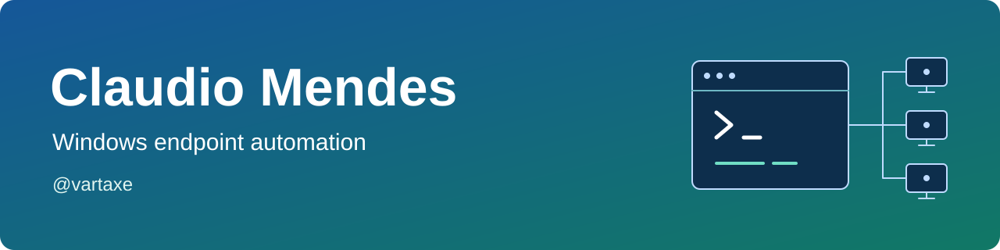

<h1>
  <picture>
    <source media="(prefers-color-scheme: dark) and (max-width: 600px)" srcset="assets/profile-dark-compact.svg" width="720">
    <source media="(max-width: 600px)" srcset="assets/profile-light-compact.svg" width="720">
    <source media="(prefers-color-scheme: dark)" srcset="assets/profile-dark.svg" width="1280">
    
  </picture>
</h1>

I'm **Claudio Mendes (@vartaxe)**. I write PowerShell tools for the repeatable jobs
around Windows deployment, with clear inputs, useful logs, and explicit outcomes.
Most of the work here brings together Microsoft Configuration Manager and Active Directory.

  
  
  
  

[Projects](#projects) · [Website and guides][website] · [Development setup](docs/workstation.md) · [Contact](#contact)

## Projects

Both tools are self-contained **Windows PowerShell 5.1** scripts under the **MIT
license**. Start with the deployment and compatibility guides, then validate the
task-sequence step in your own environment.

###  [Add computers to AD groups][ad-repo]

[![Add computers to AD groups: CI status][ad-ci-badge]][ad-ci]

Add computer accounts to Active Directory groups during a ConfigMgr task sequence.
Uses **Kerberos over LDAPS by default**, verifies group membership, and logs the result
in CMTrace format.

[Code][ad-repo] · [Documentation][ad-docs] · [Releases][ad-releases] · [Gist][ad-gist] · [Deployment][ad-deployment]

###  [Copy OSD logs to a file share][logs-repo]

[![Copy OSD logs to a file share: CI status][logs-ci-badge]][logs-ci]

Collect and archive OSD logs, then upload them to an SMB share. Includes **upload retries
and remote size checks**, and keeps the local archive if the upload fails.

[Code][logs-repo] · [Documentation][logs-docs] · [Releases][logs-releases] · [Gist][logs-gist] · [Deployment][logs-deployment]

Gists are standalone snapshots with MIT notices and checksums. The repositories
and release packages remain the authoritative source for deployment guidance.

> [!NOTE]
> Automated checks cover syntax, static analysis, and mocked scenarios. Live-environment
> testing has not been performed for this release. Use the [AD group validation guide][ad-validation]
> and [OSD log validation guide][logs-validation] to plan your rollout.

  
More about security, logging, and compatibility

- **AD group membership:** bounded retries and domain controller failover.
- **Log collection:** WinPE support with explicit compatibility controls. Read the deployment
  guide before enabling an exception.
- **Security:** no credentials in command lines or source, no certificate-validation bypass,
  and no silent fallback to weaker authentication or transport.
- **Troubleshooting:** sanitized CMTrace-compatible logs, documented exit codes, and
  troubleshooting guides.
- **Automated checks:** PSScriptAnalyzer and mocked Pester tests, kept separate from live
  ConfigMgr, Active Directory, WinPE, and SMB testing.

## Development

[Set up a Windows workstation](docs/workstation.md) for Git, repository access,
PowerShell editing, and the same validation tools used in CI.

## Contact

[vartaxe@outlook.com](mailto:vartaxe@outlook.com) · [Sponsor my work][sponsor]

These tools are free and open source. Sponsorship helps cover testing, documentation,
and maintenance.

Please report security issues through the affected repository's private vulnerability
reporting, not a public issue.

[sponsor]: https://github.com/sponsors/vartaxe
[website]: https://vartaxe.github.io/vartaxe/
[ad-repo]: https://github.com/vartaxe/ConfigMgr-OSD-AddComputerToADGroup
[ad-docs]: https://vartaxe.github.io/ConfigMgr-OSD-AddComputerToADGroup/
[ad-ci]: https://github.com/vartaxe/ConfigMgr-OSD-AddComputerToADGroup/actions/workflows/ci.yml?query=branch%3Amain+event%3Apush
[ad-ci-badge]: https://github.com/vartaxe/ConfigMgr-OSD-AddComputerToADGroup/actions/workflows/ci.yml/badge.svg?branch=main&event=push
[ad-releases]: https://github.com/vartaxe/ConfigMgr-OSD-AddComputerToADGroup/releases
[ad-gist]: https://gist.github.com/vartaxe/99dc4be2d6dbf8cda0b93e2de3f0d906
[ad-deployment]: https://vartaxe.github.io/ConfigMgr-OSD-AddComputerToADGroup/docs/deployment.html
[ad-validation]: https://vartaxe.github.io/ConfigMgr-OSD-AddComputerToADGroup/docs/validation.html
[logs-repo]: https://github.com/vartaxe/ConfigMgr-OSD-CopyOSDLogToFileShare
[logs-docs]: https://vartaxe.github.io/ConfigMgr-OSD-CopyOSDLogToFileShare/
[logs-ci]: https://github.com/vartaxe/ConfigMgr-OSD-CopyOSDLogToFileShare/actions/workflows/ci.yml?query=branch%3Amain+event%3Apush
[logs-ci-badge]: https://github.com/vartaxe/ConfigMgr-OSD-CopyOSDLogToFileShare/actions/workflows/ci.yml/badge.svg?branch=main&event=push
[logs-releases]: https://github.com/vartaxe/ConfigMgr-OSD-CopyOSDLogToFileShare/releases
[logs-gist]: https://gist.github.com/vartaxe/cd41f830cddc7853f5189713421a601b
[logs-deployment]: https://vartaxe.github.io/ConfigMgr-OSD-CopyOSDLogToFileShare/docs/deployment.html
[logs-validation]: https://vartaxe.github.io/ConfigMgr-OSD-CopyOSDLogToFileShare/docs/validation.html
