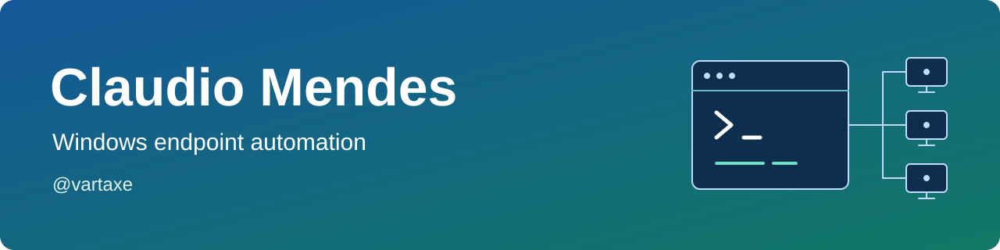

<h1>
  <picture>
    <source media="(prefers-color-scheme: dark) and (max-width: 600px)" srcset="assets/profile-dark-compact.svg" width="720" height="260">
    <source media="(max-width: 600px)" srcset="assets/profile-light-compact.svg" width="720" height="260">
    <source media="(prefers-color-scheme: dark)" srcset="assets/profile-dark.svg" width="1280" height="320">
    
  </picture>
</h1>

I'm **Claudio Mendes (@vartaxe)**. I write PowerShell tools for the repeatable jobs
around Windows deployment, with clear inputs, useful logs, and explicit outcomes.
Most of the work here brings together Microsoft Configuration Manager and Active Directory.

  
  
  
  

[Projects](#projects) · [Maintained forks](#maintained-forks) · [Website and guides][website] · [Development setup](docs/workstation.md) · [Contact](#contact)

## Projects

The tools are self-contained **Windows PowerShell 5.1** scripts under the **MIT
license**. Start with the deployment and compatibility guides, then validate the
task-sequence step in your own environment.

###  [Add computers to AD groups][ad-repo]

[![Add computers to AD groups: CI status][ad-ci-badge]][ad-ci]

Add computer accounts to Active Directory groups during a ConfigMgr task sequence.
Uses **Kerberos over LDAPS by default**, verifies group membership, and logs the result
in CMTrace format.

[Code][ad-repo] · [Documentation][ad-docs] · [Releases][ad-releases] · [Gist][ad-gist] · [Deployment][ad-deployment]

###  [Copy OSD logs to a file share][logs-repo]

[![Copy OSD logs to a file share: CI status][logs-ci-badge]][logs-ci]

Collect and archive OSD logs, then upload them to an SMB share. Includes **upload retries
and remote size checks**, and keeps the local archive if the upload fails.

[Code][logs-repo] · [Documentation][logs-docs] · [Releases][logs-releases] · [Gist][logs-gist] · [Deployment][logs-deployment]

###  [Disk partition layout][disk-repo]

[![Disk partition layout: CI status][disk-ci-badge]][disk-ci]

Apply a disk layout in WinPE during a ConfigMgr task sequence. **It irreversibly
cleans and repartitions the target disk**, so test it on disposable hardware first.

[Code][disk-repo] · [Documentation][disk-docs] · [Releases][disk-releases]

Part of the [ConfigMgr-OSD hub][hub], which links every OSD script project.
Gists are standalone snapshots with MIT notices and checksums. The repositories
and release packages remain the authoritative source for deployment guidance.

> [!NOTE]
> Automated checks cover syntax, static analysis, and mocked scenarios. Live-environment
> testing has not been performed for this release. Use the [AD group validation guide][ad-validation]
> and [OSD log validation guide][logs-validation], plus the [disk-layout compatibility
> matrix][disk-validation], to plan your rollout.

  
More about security, logging, and compatibility

- **AD group membership:** bounded retries and domain controller failover.
- **Log collection:** WinPE support with explicit compatibility controls. Read the deployment
  guide before enabling an exception.
- **Security:** no credentials in command lines or source, no certificate-validation bypass,
  and no silent fallback to weaker authentication or transport.
- **Troubleshooting:** sanitized CMTrace-compatible logs, documented exit codes, and
  troubleshooting guides.
- **Automated checks:** PSScriptAnalyzer and mocked Pester tests, kept separate from live
  ConfigMgr, Active Directory, WinPE, and SMB testing.

## Maintained fork

Endpoint-management maintenance is consolidated in:

- [Driver Automation Tool][dat-fork] — fork of
  [maurice-daly/DriverAutomationTool][dat-upstream], including the maintained
  ConfigMgr driver/BIOS package selectors and Dell, HP, Lenovo, and Microsoft
  BIOS apply scripts.

The former Modern Driver Management and Modern BIOS Management forks are archived
compatibility sources; future maintenance belongs in DAT. Review the fork history,
upstream documentation, and compatibility guidance before production use.

## Development

[Set up a Windows workstation](docs/workstation.md) for Git, repository access,
PowerShell editing, and the same validation tools used in CI.

## Contact

[vartaxe@outlook.com](mailto:vartaxe@outlook.com) · [Sponsor my work][sponsor]

These tools are free and open source. Sponsorship helps cover testing, documentation,
and maintenance.

Please follow the affected repository's security policy when reporting a vulnerability.
Use private vulnerability reporting when it is available; otherwise use the private
contact method documented there. Do not report security issues in a public issue.

[sponsor]: https://github.com/sponsors/vartaxe
[website]: https://vartaxe.github.io/vartaxe/
[ad-repo]: https://github.com/vartaxe/ConfigMgr-OSD-AddComputerToADGroup
[ad-docs]: https://vartaxe.github.io/ConfigMgr-OSD-AddComputerToADGroup/
[ad-ci]: https://github.com/vartaxe/ConfigMgr-OSD-AddComputerToADGroup/actions/workflows/ci.yml?query=branch%3Amain+event%3Apush
[ad-ci-badge]: https://github.com/vartaxe/ConfigMgr-OSD-AddComputerToADGroup/actions/workflows/ci.yml/badge.svg?branch=main&event=push
[ad-releases]: https://github.com/vartaxe/ConfigMgr-OSD-AddComputerToADGroup/releases
[ad-gist]: https://gist.github.com/vartaxe/99dc4be2d6dbf8cda0b93e2de3f0d906
[ad-deployment]: https://vartaxe.github.io/ConfigMgr-OSD-AddComputerToADGroup/docs/deployment.html
[ad-validation]: https://vartaxe.github.io/ConfigMgr-OSD-AddComputerToADGroup/docs/validation.html
[logs-repo]: https://github.com/vartaxe/ConfigMgr-OSD-CopyOSDLogToFileShare
[logs-docs]: https://vartaxe.github.io/ConfigMgr-OSD-CopyOSDLogToFileShare/
[logs-ci]: https://github.com/vartaxe/ConfigMgr-OSD-CopyOSDLogToFileShare/actions/workflows/ci.yml?query=branch%3Amain+event%3Apush
[logs-ci-badge]: https://github.com/vartaxe/ConfigMgr-OSD-CopyOSDLogToFileShare/actions/workflows/ci.yml/badge.svg?branch=main&event=push
[logs-releases]: https://github.com/vartaxe/ConfigMgr-OSD-CopyOSDLogToFileShare/releases
[logs-gist]: https://gist.github.com/vartaxe/cd41f830cddc7853f5189713421a601b
[logs-deployment]: https://vartaxe.github.io/ConfigMgr-OSD-CopyOSDLogToFileShare/docs/deployment.html
[logs-validation]: https://vartaxe.github.io/ConfigMgr-OSD-CopyOSDLogToFileShare/docs/validation.html
[hub]: https://vartaxe.github.io/ConfigMgr-OSD/
[disk-repo]: https://github.com/vartaxe/ConfigMgr-OSD-DiskPartitionLayout
[disk-docs]: https://vartaxe.github.io/ConfigMgr-OSD-DiskPartitionLayout/
[disk-ci]: https://github.com/vartaxe/ConfigMgr-OSD-DiskPartitionLayout/actions/workflows/ci.yml?query=branch%3Amain+event%3Apush
[disk-ci-badge]: https://github.com/vartaxe/ConfigMgr-OSD-DiskPartitionLayout/actions/workflows/ci.yml/badge.svg?branch=main&event=push
[disk-releases]: https://github.com/vartaxe/ConfigMgr-OSD-DiskPartitionLayout/releases
[disk-validation]: https://vartaxe.github.io/ConfigMgr-OSD-DiskPartitionLayout/docs/COMPATIBILITY-MATRIX.html
[dat-fork]: https://github.com/vartaxe/DriverAutomationTool
[dat-upstream]: https://github.com/maurice-daly/DriverAutomationTool
